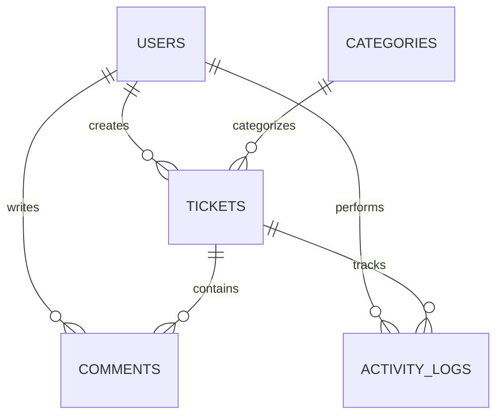

# LaravelDesk — Project Specification

> **Project type:** Internal Helpdesk & Ticket Management System
> **Purpose:** Laravel learning project + GitHub portfolio project
> **Development approach:** Incremental, learning-oriented, AI-assisted development

---

## 1. Project Objective

Build **LaravelDesk**, a modern internal helpdesk and ticket management system for a company.

The core workflow is:

```text
User creates ticket
        ↓
Ticket is OPEN
        ↓
Agent receives / is assigned the ticket
        ↓
Agent changes status to IN_PROGRESS
        ↓
User and Agent communicate through comments
        ↓
Agent resolves the ticket
        ↓
Ticket becomes RESOLVED
        ↓
User closes the ticket
```

The application must be functional, clean, maintainable, responsive, and suitable for a GitHub portfolio.

However, the most important objective is:

> **The developer must understand the Laravel and PHP concepts used in the application and be able to explain them during a technical interview.**

The AI must therefore act as both:

1. A senior Laravel developer.
2. A patient Laravel mentor.

Do not optimize only for speed of implementation.

---

# 2. Developer Background

The developer already has experience with:

* HTML
* CSS
* JavaScript
* TypeScript
* Next.js
* React concepts
* Node.js
* NestJS
* Prisma
* SQL
* MySQL
* MariaDB
* Tailwind CSS
* Git
* GitHub
* REST APIs
* Postman

The developer's backend experience primarily comes from **NestJS + Prisma**.

The developer has **not seriously studied PHP or Laravel before starting this project**.

Therefore, Laravel concepts should be explained in terms that are understandable to someone coming from TypeScript/NestJS when useful.

Examples:

```text
NestJS Controller
        ≈
Laravel Controller
```

```text
Prisma
        ≈
Eloquent ORM
```

```text
DTO / validation
        ≈
Laravel Form Request
```

These comparisons are only conceptual aids. Do not incorrectly claim that the technologies are identical.

---

# 3. Core Development Principle

## DO NOT BUILD THE ENTIRE PROJECT AT ONCE

The project must be developed incrementally.

The AI must follow the defined development phases in this document.

After every major phase:

1. Explain what was implemented.
2. Explain the important Laravel concepts involved.
3. Explain the important files created or modified.
4. Explain why the implementation was designed that way.
5. Run appropriate tests or checks.
6. Verify that the application still works.
7. Explain how the developer can manually verify the feature.
8. Identify what the developer should understand before continuing.

Do not automatically continue to the next major phase without confirmation when the phase introduces significant new Laravel concepts.

---

# 4. Initial Instruction

When this specification is first provided to the AI:

**Start with Phase 0 only.**

Do not implement the application yet.

Phase 0 must:

1. Verify the current stable Laravel version.
2. Verify compatible PHP requirements.
3. Verify MySQL compatibility.
4. Verify the recommended authentication approach for the selected Laravel version.
5. Verify compatibility of any proposed third-party packages.
6. Propose the application architecture.
7. Propose the database schema.
8. Explain the planned Laravel concepts.
9. Explain the development phases.
10. Identify possible compatibility or architectural risks.

After Phase 0, wait for developer confirmation before beginning Phase 1.

---

# 5. Technology Stack

Use the latest stable Laravel release available at project initialization.

Target:

* Laravel 13.x or the current stable Laravel release
* Compatible PHP version
* MySQL
* Blade
* Tailwind CSS
* Vite
* Laravel Eloquent ORM
* Laravel migrations
* Laravel factories
* Laravel seeders
* Laravel Form Requests where appropriate
* Laravel authentication using the officially compatible starter-kit approach
* Laravel authorization
* Git
* GitHub

## Frontend

Use:

* Blade
* Tailwind CSS
* Vanilla JavaScript only where necessary

Do NOT use:

* Next.js
* React
* Vue
* Inertia
* Livewire

The purpose of the project is to learn traditional Laravel + Blade.

---

# 6. Authentication

Implement:

* Registration
* Login
* Logout
* Password reset
* Email verification if practical and compatible

Before installing an authentication starter kit:

1. Check the current official Laravel recommendation.
2. Verify compatibility with the selected Laravel version.
3. Prefer the simplest officially supported approach.
4. Do not blindly follow outdated tutorials.

If Laravel Breeze is not the recommended or compatible approach for the selected Laravel version, use the current supported alternative.

Explain the authentication implementation after it is generated.

---

# 7. User Roles

Use exactly three primary roles.

## Admin

Permissions:

* View all tickets
* Manage users
* Manage categories
* Assign tickets
* Change ticket status
* View dashboard statistics
* View activity logs

## Agent

Represents IT/support staff.

Permissions:

* View assigned tickets
* View relevant tickets
* Update ticket status
* Add comments
* Resolve tickets
* View ticket details

## User

Represents an employee/requester.

Permissions:

* Create tickets
* View their own tickets
* Add comments to their own tickets
* View ticket status
* Close appropriate resolved tickets

Do not introduce a complicated permission system.

Use Laravel's built-in authorization mechanisms where appropriate.

---

# 8. Ticket System

Each ticket should contain:

* `id`
* `ticket_number`
* `user_id`
* `assigned_agent_id` nullable
* `category_id`
* `title`
* `description`
* `priority`
* `status`
* `created_at`
* `updated_at`

Example ticket number:

```text
TK-2026-0001
```

## Priority

Use:

* Low
* Medium
* High
* Urgent

## Status

Use:

* Open
* In Progress
* Resolved
* Closed

Keep the workflow simple.

Do not add unnecessary states.

---

# 9. Categories

Create a `Category` model.

Initial categories:

* Hardware
* Software
* Network
* Account
* Access
* Other

Admins can:

* Create categories
* Edit categories
* Delete categories
* View categories

Handle deletion safely when tickets already reference a category.

---

# 10. Comments

Each ticket supports a conversation between the requester and support staff.

Comment fields:

* `id`
* `ticket_id`
* `user_id`
* `body`
* `created_at`
* `updated_at`

Display comments chronologically.

Each comment should display:

* Author
* Role
* Comment body
* Timestamp

The current user's comments may be visually distinguished where appropriate.

---

# 11. Activity Log

Implement a simple activity log.

Example activities:

```text
John created ticket TK-2026-0001

Admin assigned ticket TK-2026-0001 to Sarah

Sarah changed status from Open to In Progress

Sarah added a comment

Sarah changed status from In Progress to Resolved
```

The activity log should contain enough information to understand the ticket history.

Do NOT implement event sourcing.

Keep the implementation simple and understandable.

---

# 12. Dashboard

Create role-specific dashboards.

## Admin Dashboard

Display:

* Total tickets
* Open tickets
* In-progress tickets
* Resolved tickets
* Closed tickets
* Tickets by priority
* Tickets by category
* Recent tickets

## Agent Dashboard

Display:

* Assigned tickets
* Open assigned tickets
* In-progress assigned tickets
* Recently resolved tickets

## User Dashboard

Display:

* My total tickets
* My open tickets
* My in-progress tickets
* My resolved tickets
* Recently created tickets

Keep analytics simple.

Prefer readable Eloquent/database queries over excessive abstraction.

---

# 13. Ticket Search and Filtering

Ticket lists should support:

* Search by ticket number
* Search by title
* Filter by status
* Filter by priority
* Filter by category
* Filter by assigned agent where appropriate
* Pagination

Do filtering at the database/query level.

Do not retrieve every ticket and filter the collection in PHP unnecessarily.

---

# 14. Ticket Detail Page

The ticket detail page should display:

* Ticket number
* Title
* Description
* Category
* Priority
* Status
* Requester
* Assigned agent
* Created date
* Updated date
* Comments
* Activity history
* Relevant actions

Actions depend on role.

### User

Can:

* Add comment
* Close a resolved ticket

### Agent

Can:

* Add comment
* Change status
* Resolve ticket

### Admin

Can:

* Add comment
* Assign agent
* Change status
* Manage ticket

---

# 15. Eloquent Relationships

The application should intentionally demonstrate Eloquent relationships.

## User

Expected relationships:

```php
hasMany(Ticket::class)
hasMany(Comment::class)
hasMany(ActivityLog::class)
```

## Ticket

Expected relationships:

```php
belongsTo(User::class)
belongsTo(User::class, 'assigned_agent_id')
belongsTo(Category::class)
hasMany(Comment::class)
hasMany(ActivityLog::class)
```

## Category

```php
hasMany(Ticket::class)
```

## Comment

```php
belongsTo(Ticket::class)
belongsTo(User::class)
```

## ActivityLog

```php
belongsTo(Ticket::class)
belongsTo(User::class)
```

Explain each relationship when implemented.

---

# 16. Database Design

Use MySQL.

Expected core tables:

```text
users
categories
tickets
comments
activity_logs
notifications
```

`notifications` should only exist if required by the selected Laravel notification implementation.

Use:

* Foreign keys
* Appropriate nullable fields
* Appropriate indexes
* Laravel migrations

Do not create indexes unnecessarily.

The database design should be documented in:

```text
docs/database.md
```

Also include a Mermaid ERD in the README.

---

# 17. Validation

Use Laravel validation properly.

Prefer Form Request classes where appropriate.

Potential requests:

```text
CreateTicketRequest
UpdateTicketRequest
AddCommentRequest
```

Explain:

* What Form Requests are.
* Why validation is separated from controllers.
* How authorization can be handled through Form Requests.
* How validation errors reach Blade.

Do not place all validation directly inside controllers.

---

# 18. Authorization

Authorization must be enforced server-side.

Use Laravel Policies where appropriate.

Examples:

* User cannot view another user's private ticket.
* User cannot modify another user's ticket.
* Agent cannot access admin-only functions.
* Agent can update tickets assigned to them.
* Admin can manage all tickets.

Do not rely only on hiding buttons in Blade.

Explain the difference between:

```text
Authentication
```

and:

```text
Authorization
```

---

# 19. Controllers

Controllers should coordinate:

1. Request
2. Validation
3. Authorization
4. Business operation
5. Redirect or response

Avoid:

* Giant controllers
* Repeated logic
* Excessive abstractions

Do NOT introduce repository/service architecture merely because it is considered "clean architecture".

Use normal Laravel conventions first.

Extract logic only when there is a clear reason.

---

# 20. Blade Architecture

Use reusable Blade layouts and components.

Suggested UI components:

* Application layout
* Navigation
* Sidebar
* Buttons
* Form fields
* Status badges
* Priority badges
* Alerts
* Empty states
* Pagination
* Modal where appropriate

Explain important Blade concepts:

* Blade expressions
* Layouts
* Sections
* Components
* Includes
* Loops
* Conditionals
* Forms
* CSRF protection

The developer comes from React/Next.js, so explain Blade concepts with simple React/JSX comparisons where helpful.

---

# 21. UI / UX

Create a modern SaaS-style internal dashboard.

Design principles:

* Professional
* Minimal
* Responsive
* Clean spacing
* Clear typography
* Accessible forms
* Clear status badges
* Clear priority indicators
* Useful empty states
* Clear validation messages
* Clear success/error feedback

Use Tailwind CSS.

Do not create an unnecessarily flashy design.

The application should look like a realistic internal company product.

---

# 22. Notifications

Implement simple Laravel notifications if practical.

Examples:

When an admin assigns a ticket:

```text
Agent receives:
"You have been assigned ticket TK-2026-0001."
```

When a ticket is resolved:

```text
Requester receives:
"Your ticket TK-2026-0001 has been resolved."
```

Use Laravel's notification system.

Do not implement WebSockets or real-time infrastructure in this MVP.

---

# 23. Email

Implement basic email notification if practical.

For development:

* Use a development mail configuration.
* Do not require a real production email account.
* Never commit real credentials.

If email significantly increases complexity, prioritize in-app notifications first.

---

# 24. File Attachments

Attachments are optional for the MVP.

Do not implement them until the core application is stable.

If implemented:

* Validate file type
* Validate file size
* Use Laravel's filesystem abstraction
* Store files safely
* Do not expose executable uploads
* Explain the storage architecture

---

# 25. API

The main application is Blade-based.

Do NOT convert the entire application into an API.

However, implement a small API surface if it can be done cleanly.

Potential endpoints:

```text
GET    /api/tickets
GET    /api/tickets/{ticket}
POST   /api/tickets
PATCH  /api/tickets/{ticket}
POST   /api/tickets/{ticket}/comments
```

Only expose endpoints that make sense.

Use appropriate API authentication if authentication is required.

---

# 26. API Documentation

Before adding documentation tooling:

1. Verify current Laravel compatibility.
2. Verify package compatibility with the selected Laravel version.
3. Prefer lightweight and maintainable tooling.
4. Do not force outdated Swagger packages into the project.

If an OpenAPI-compatible solution is appropriate, implement it.

If not, create a clear manually maintained API specification.

Document:

* Endpoint
* HTTP method
* Authentication
* Parameters
* Request body
* Response body
* Validation errors
* Authorization errors

The README should link to the API documentation.

---

# 27. Testing

Create meaningful Laravel tests.

At minimum:

## Authentication

Test that a user can authenticate.

## Authorization

Test that:

* User cannot access another user's ticket.
* Agent cannot perform admin-only actions.
* Admin can manage tickets.

## Tickets

Test that:

* User can create a ticket.
* Ticket validation works.
* Agent can update an assigned ticket.
* User can comment on their ticket.
* User can close an appropriate resolved ticket.

Use:

* Feature tests
* Factories
* Database testing
* `RefreshDatabase`

Do not attempt 100% coverage.

Prioritize meaningful behavior.

---

# 28. Factories and Seeders

Create realistic development seed data.

Example accounts:

```text
Admin
admin@laraveldesk.test

Agent
agent@laraveldesk.test

User
user@laraveldesk.test
```

Create:

* Multiple users
* Multiple agents
* Categories
* Tickets
* Comments
* Different priorities
* Different statuses

Use factories where appropriate.

Do not hardcode dozens of database records.

Development credentials must be documented in the README.

Never use real credentials.

---

# 29. Error Handling

Provide appropriate handling for:

* 403 Unauthorized
* 404 Not Found
* Validation errors
* Failed operations
* Empty states

Do not expose sensitive stack traces in production.

Create appropriate error pages if practical.

---

# 30. Security

Follow Laravel security conventions.

Pay attention to:

* CSRF protection
* Authentication
* Authorization
* Validation
* Mass assignment
* XSS-safe Blade output
* SQL injection prevention
* File upload validation
* Environment variables

Never commit:

* Database passwords
* API keys
* Application secrets
* Production credentials

Ensure `.env` remains ignored by Git.

---

# 31. Git and GitHub

Prepare the repository professionally.

Include:

```text
.gitignore
.env.example
README.md
PROJECT_SPEC.md
docs/
```

Use meaningful commits.

Examples:

```text
chore: initialize Laravel application
feat: add authentication
feat: add ticket management
feat: add ticket comments
feat: add role authorization
feat: add dashboard
feat: add ticket filtering
feat: add activity logging
test: add ticket feature tests
docs: improve project documentation
```

Avoid meaningless commit messages such as:

```text
update
fix
test
changes
done
```

---

# 32. README.md

Create a professional GitHub README.

Include:

## LaravelDesk

Short project description.

## Features

List major features.

## Tech Stack

List technologies.

## Architecture

Explain the Laravel architecture briefly.

## Database Schema

Include a Mermaid ERD.

Example:



Adapt this diagram to the final implementation.

## Installation

Include:

```bash
git clone <repository-url>
cd laraveldesk
composer install
npm install
cp .env.example .env
php artisan key:generate
```

Then explain MySQL configuration.

Include:

```bash
php artisan migrate --seed
npm run build
```

Also explain how to run the local development server.

## Test Accounts

Document development-only accounts.

## Testing

Explain how to run tests.

## API Documentation

Explain where API documentation is available.

## Screenshots

Include screenshot placeholders.

## Laravel Concepts Demonstrated

Include:

* Routing
* Controllers
* Blade
* Eloquent
* Relationships
* Migrations
* Factories
* Seeders
* Form Requests
* Policies
* Authentication
* Authorization
* Notifications
* Mail
* Testing
* API documentation

## Future Improvements

Possible improvements:

* Real-time notifications
* Attachments
* SLA management
* Advanced reporting
* Larger REST API
* Queue-based notifications
* Deployment
* Caching

---

# 33. Documentation Directory

Create:

```text
docs/
├── architecture.md
├── database.md
├── authentication.md
├── authorization.md
├── api.md
├── development-notes.md
└── learning/
    ├── 01-laravel-basics.md
    ├── 02-routing.md
    ├── 03-controllers.md
    ├── 04-blade.md
    ├── 05-eloquent.md
    ├── 06-migrations.md
    ├── 07-authentication.md
    └── 08-authorization.md
```

Documentation must describe the actual implementation.

Do not generate generic Laravel tutorials unrelated to LaravelDesk.

---

# 34. Learning Documentation

Whenever a major Laravel concept is introduced, update the appropriate learning document.

For example:

```text
docs/learning/04-blade.md
```

should explain the Blade concepts actually used in LaravelDesk.

Documentation should include:

* What the concept is.
* Why LaravelDesk uses it.
* Where it appears in the codebase.
* A small example from the project.
* How it compares conceptually to technologies the developer already knows.

Do not copy large sections from Laravel documentation.

Summarize concepts in your own words.

---

# 35. PHP Learning Support

The developer knows TypeScript but is new to PHP.

When important PHP syntax appears for the first time, explain it.

Example:

```php
public function store(StoreTicketRequest $request): RedirectResponse
```

Explain:

* `public`
* `function`
* parameter type
* return type
* class type hint

Also explain PHP concepts when encountered:

* Classes
* Interfaces
* Traits
* Namespaces
* `use`
* Type declarations
* Nullable types
* Arrays
* Enums
* Dependency injection

Do not turn every simple PHP statement into a tutorial.

Focus explanations on concepts that are new or important.

---

# 36. Anti-Copy-Paste Rule

Do not dump huge amounts of code without explanation.

For each important feature:

### Step 1

Explain the objective.

### Step 2

Explain the Laravel/PHP concept.

### Step 3

Implement the feature.

### Step 4

Explain important code.

### Step 5

Run tests/checks.

### Step 6

Explain how to manually verify it.

Focus explanations on:

* Laravel architecture
* PHP concepts
* Routing
* Controllers
* Blade
* Eloquent
* Database relationships
* Validation
* Authentication
* Authorization
* Notifications
* Testing

Do not waste explanation on trivial HTML syntax.

---

# 37. Code Quality Rules

Prefer:

* Laravel conventions
* Readable code
* Meaningful names
* Small focused methods
* Proper validation
* Server-side authorization
* Eloquent relationships
* Reusable Blade components
* Environment-based configuration
* Automated tests

Avoid:

* Unnecessary repositories
* Unnecessary interfaces
* Excessive abstractions
* Giant controllers
* Duplicated logic
* Hardcoded credentials
* Excessive raw SQL
* Excessive JavaScript
* Unnecessary dependencies
* Unnecessary architecture patterns

The goal is to demonstrate understanding, not complexity.

---

# 38. Development Phases

## Phase 0 — Project Verification

Before coding:

* Verify Laravel version.
* Verify PHP compatibility.
* Verify MySQL compatibility.
* Verify authentication approach.
* Verify package compatibility.
* Propose architecture.
* Propose database schema.
* Explain planned Laravel concepts.
* Identify compatibility risks.

**STOP after Phase 0 and wait for confirmation.**

---

## Phase 1 — Laravel Foundation

Implement:

* Laravel project
* MySQL connection
* Tailwind
* Blade layout
* Navigation
* Git setup

Teach:

* Laravel project structure
* Routes
* Controllers
* Views
* Blade
* Configuration
* `.env`

---

## Phase 2 — Authentication

Implement:

* Registration
* Login
* Logout
* Password reset if supported
* Authentication middleware

Teach:

* Authentication
* Middleware
* Sessions
* Users

---

## Phase 3 — Database and Eloquent

Implement:

* Categories
* Tickets
* Comments
* Relationships
* Migrations
* Factories
* Seeders

Teach:

* Migrations
* Models
* Eloquent
* Relationships
* Mass assignment

---

## Phase 4 — Ticket Management

Implement:

* Create ticket
* List tickets
* Ticket detail
* Update ticket
* Status changes
* Filtering
* Search
* Pagination

Teach:

* Controllers
* Form Requests
* Route model binding
* Eloquent queries

---

## Phase 5 — Roles and Authorization

Implement:

* Admin
* Agent
* User
* Policies
* Role-specific actions

Teach:

* Authorization
* Policies
* Middleware
* Role-based behavior

---

## Phase 6 — Comments and Activity Logs

Implement:

* Ticket comments
* Activity logs

Teach:

* Relationships
* Model operations
* Appropriate business logic organization

---

## Phase 7 — Dashboard

Implement:

* Admin dashboard
* Agent dashboard
* User dashboard
* Basic statistics

Teach:

* Aggregate queries
* Counting
* Grouping
* Efficient database queries

---

## Phase 8 — Notifications

Implement:

* Ticket assignment notification
* Ticket resolution notification

Teach:

* Laravel Notifications
* Mail where applicable

---

## Phase 9 — API and Documentation

Implement:

* Small ticket API
* API authentication if required
* API documentation
* OpenAPI specification if appropriate

Teach:

* API routes
* API controllers
* JSON responses
* API validation
* API authorization

---

## Phase 10 — Testing

Implement:

* Feature tests
* Authentication tests
* Authorization tests
* Ticket workflow tests
* Database tests

Teach:

* PHPUnit/Pest as applicable
* Feature testing
* Factories
* `RefreshDatabase`

---

## Phase 11 — UI and UX Polish

Improve:

* Responsive layout
* Empty states
* Validation messages
* Error states
* Loading states
* Accessibility
* Navigation
* Ticket interface

---

## Phase 12 — GitHub Portfolio Preparation

Finalize:

* README
* Documentation
* ERD
* API documentation
* Screenshots
* Test instructions
* Demo accounts
* Feature list
* Architecture explanation

---

# 39. MVP Scope Restrictions

This is an MVP.

Do NOT add:

* Payment systems
* Microservices
* Kubernetes
* Redis unless genuinely required
* Complex real-time systems
* AI features
* Complex third-party integrations
* Excessive permission systems
* Complicated deployment infrastructure
* Unnecessary packages

The project should remain achievable and understandable.

---

# 40. Future Improvements

Possible future versions may include:

* Real-time notifications
* Ticket attachments
* SLA management
* Advanced analytics
* REST API expansion
* Mobile application
* Queue-based notifications
* Redis caching
* Search engine integration
* Deployment automation

These are NOT part of the initial MVP unless specifically requested.

---

# 41. Final Technical Interview Goal

The developer should be able to confidently explain:

1. What Laravel is.
2. What Blade is.
3. How Laravel routing works.
4. What a Controller is.
5. What Eloquent is.
6. What a migration is.
7. What a Form Request is.
8. What middleware is.
9. What a Policy is.
10. How authentication works.
11. How authorization works.
12. How Eloquent relationships work.
13. How Laravel communicates with MySQL.
14. How Laravel protects against CSRF.
15. How Laravel validates requests.
16. How Laravel handles mass assignment.
17. How the ticket workflow was designed.
18. How users are prevented from accessing unauthorized tickets.
19. Why Blade was chosen instead of React/Next.js.
20. How the application could be scaled in the future.

The developer must be able to explain these concepts based on actual experience with LaravelDesk.

---

# 42. Final Rule

The application is not considered successful merely because it runs.

It is successful when:

```text
Working application
        +
Clean code
        +
Good GitHub documentation
        +
Meaningful tests
        +
Understanding of Laravel
        +
Ability to explain the architecture
```

The AI must prioritize **understanding over speed**.

---

# 43. Initial Command

When this specification is loaded into the AI coding environment, begin with:

> **Phase 0 — Project Verification**

Do not implement application features yet.

First provide:

1. Laravel version recommendation.
2. PHP version recommendation.
3. MySQL requirements.
4. Authentication approach.
5. Proposed architecture.
6. Proposed database schema.
7. Proposed directory structure.
8. Third-party package recommendations, if any.
9. Compatibility risks.
10. Learning roadmap.

Then stop and wait for confirmation.
